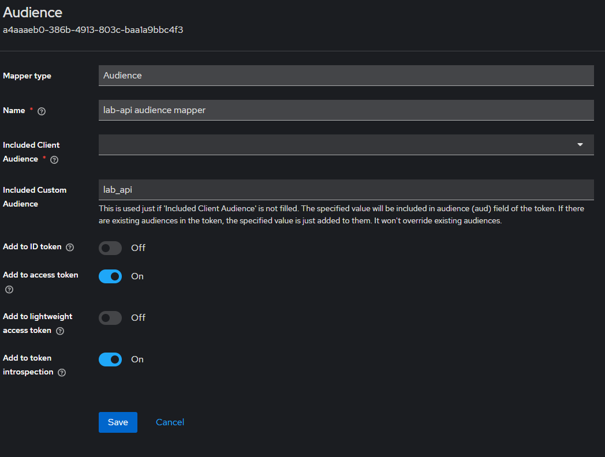
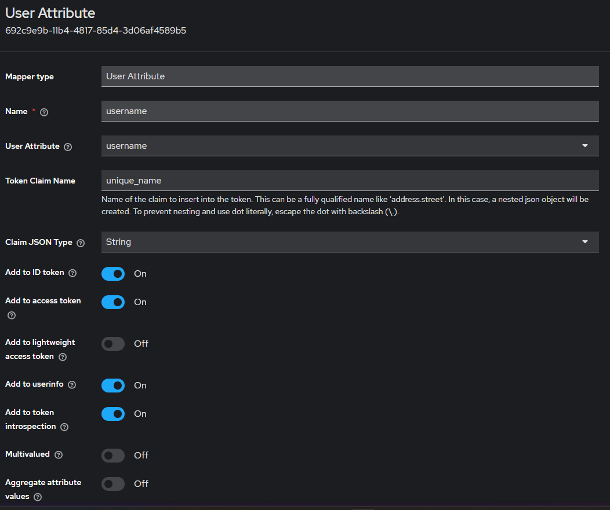

# dotnet Lab

## Authentication Server (Keyclock) prepare

- docker run
    ```bash
    docker run -d -p 8080:8080 -p 8443:8443 \
        -e KEYCLOAK_ADMIN=user \
        -e KEYCLOAK_ADMIN_PASSWORD=password \
        quay.io/keycloak/keycloak start-dev
    ```
- import test client
    - client id testing json : [link](./keyclock/test_client.json)
    - open clients page</br>
        
    - click import client</br>
        
- set client scopes mappers
  - audience mapper</br>
    
  - user name</br>
    

## architecture ref

- https://romanglushach.medium.com/hexagonal-architecture-the-secret-to-scalable-and-maintainable-code-for-modern-software-d345fdb47347
- https://en.wikipedia.org/wiki/Hexagonal_architecture_(software)
- https://medium.com/idealo-tech-blog/hexagonal-ports-adapters-architecture-e3617bcf00a0