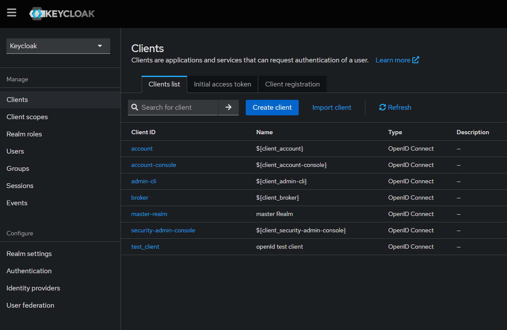
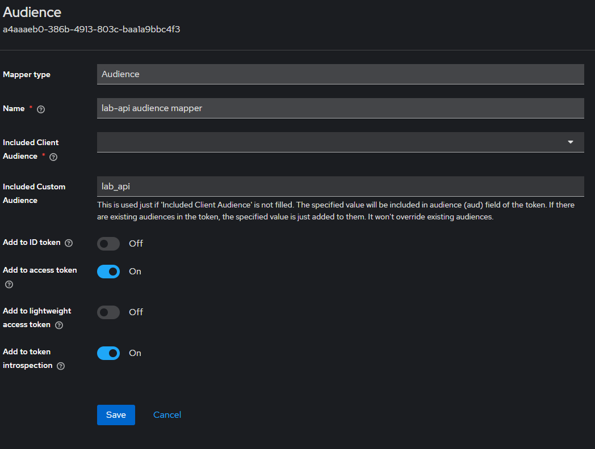
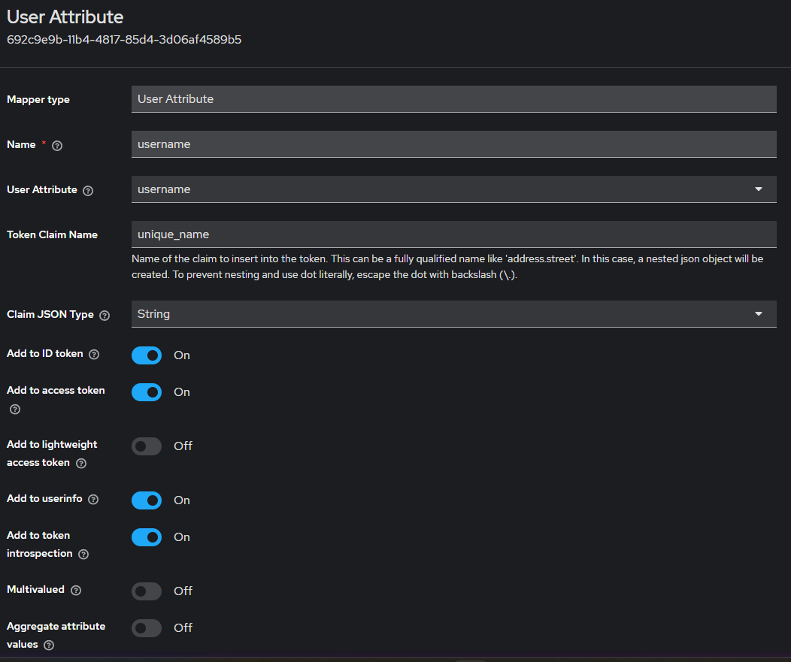

# dotnet Lab

## Authentication Server (keycloak) prepare

- docker run
    ```bash
    docker run -d -p 8080:8080 -p 8443:8443 \
        -e KEYCLOAK_ADMIN=user \
        -e KEYCLOAK_ADMIN_PASSWORD=password \
        quay.io/keycloak/keycloak start-dev
    ```
- import test client
    - client id testing json : [link](./keycloak/test_client.json)
    - open clients page</br>
        
    - click import client</br>
        
- set client scopes mappers
  - audience mapper</br>
    
  - user name</br>
    

## architecture ref

- https://romanglushach.medium.com/hexagonal-architecture-the-secret-to-scalable-and-maintainable-code-for-modern-software-d345fdb47347
- https://en.wikipedia.org/wiki/Hexagonal_architecture_(software)
- https://medium.com/idealo-tech-blog/hexagonal-ports-adapters-architecture-e3617bcf00a0

## 專案結構

> [warning]
> 以下內容為 AI 產生的草稿，編修中

本解決方案依 Clean Architecture / Hexagonal (Ports & Adapters) 原則規劃，將商業邏輯與外部世界嚴格分離；並以數字前綴標示層次，方便在 IDE 內快速辨識依賴方向（只能向「數字較小」的層級引用）。

### 整體架構

#### 方案資料夾規劃

dotnetLab Solution
├── 0. Shared-Kernel            // 共用核心與跨層關注點
├── 1. Core                      // 領域核心層
├── 2. Application               // 應用服務層
├── 3. Infrastructure and Persistence  // 基礎設施與持久層
├── 3. Presentation              // 表現層/外部介面
├── 5. Tooling                   // 開發工具
└── 6. Tests                     // 測試專案

#### 各方案資料夾中的專案倚賴方向

```
         ┌───────────────────────────┐
         │ 0. Shared-Kernel          │←─ 所有專案可使用的基礎類型/常數
         └───────────┬───────────────┘
                     │
         ┌───────────▼───────────────┐
         │ 1. Core (Domain)          │←─ 實體、值物件、聚合根、領域服務
         └───────────┬───────────────┘
                     │
         ┌───────────▼───────────────┐
         │ 2. Application            │←─ 用例(Use Case) / 服務介面(Port)
         └───────────┬───────────────┘
                     │
┌───────────┬────────▼────────┬──────────┐
│3. Infra & │ 3. Presentation │5. Tooling│
│Persistence│ (WebApi / gRPC) │          │
└───────────┴─────────────────┴──────────┘
                     │
               6. Tests（橫跨所有層）
```

### 各層詳細說明

| 資料夾 / 專案                                                                            | 角色                 | 內容重點                                                              | 只能依賴                                     |
| ----------------------------------------------------------------------------------- | ------------------ | ----------------------------------------------------------------- | ---------------------------------------- |
| **0. Shared-Kernel**<br/>`dotnetLab.SharedKernel`                                   | 共用基礎               | 例外型別、常用 Enumeration、擴充方法等純程式碼 (無狀態、可重複使用)                         | —                                        |
| **1. Core**<br/>`dotnetLab.Domains`                                                 | 域模型                | Entity、Value Object、Aggregate Root、領域事件等，純商業規則，**不含**基礎設施程式庫      | Shared-Kernel                            |
| **2. Application**<br/>`dotnetLab.UseCases`                                         | 用例 (Inbound Ports) | CQRS/Command Handler、Query Service、DTO、Interface (Outbound Ports) | Core, Shared-Kernel                      |
| **3. Infrastructure and Persistence**<br/>`dotnetLab.Persistence.*`                 | Adapter (Outbound) | Repository 實作、EF Core/RDB 設定、第三方 API Gateway Client…              | Application (僅透過介面), Core, Shared-Kernel |
| **3. Presentation**<br/>`dotnetLab.WebApi`<br/>`dotnetLab.GrpcService`              | Adapter (Inbound)  | HTTP / gRPC 端點、Request ↔ DTO 映射、驗證、快取策略等，再透過 DI 呼叫 Application    | Application, Core, Shared-Kernel         |
| **5. Tooling**<br/>`dotnetLab.Analyzers`<br/>`dotnetLab.CrossCutting.Observability` | 開發工具               | Roslyn 檢查器、日誌/追蹤封裝 (OpenTelemetry)、建置 script…                     | 最小化依賴；避免引用 Presentation                  |
| **6. Tests**                                                                        | 測試                 | Unit / Integration / Contract 測試，使用 Testcontainers、xUnit          | 可引用任何被測專案                                |

#### 0. Shared-Kernel（共用核心）

核心共用元件，可被所有層參考，包含：

- ：提供基礎抽象類型、值物件基礎、通用介面等 **dotnetLab.SharedKernel**
- ：監控、日誌記錄等跨切面關注點 **dotnetLab.CrossCutting.Observability**

#### 1. Core（領域核心層）

領域模型及業務規則的核心，獨立於任何技術框架：

- ：包含領域實體、值物件、領域事件、領域服務等 **dotnetLab.Domains**

#### 2. Application（應用服務層）

協調領域物件並執行業務用例：

- ：包含業務流程、應用服務、命令/查詢處理等 **dotnetLab.UseCases**

#### 3. Infrastructure and Persistence（基礎設施與持久層）

提供技術實作，支持其他層的功能需求：

- ：資料庫結構定義與映射 **dotnetLab.Persistence.Metadata.SampleDb**
- ：資料庫存取實作（EF Core/Dapper） **dotnetLab.Persistence.Repositories**

#### 3. Presentation（表現層）

處理外部請求並轉換為內部命令：

- ：REST API 端點 **dotnetLab.WebApi**
- ：gRPC 服務端點 **dotnetLab.GrpcService**

#### 5. Tooling（開發工具）

開發輔助工具與分析器：

- ：Roslyn 程式碼分析器，提供 DDD 相關規則檢查 **dotnetLab.Analyzers**

#### 6. Tests（測試專案）

各層級的測試專案（單元測試、整合測試、端對端測試等）

### 依賴方向原則

本專案嚴格遵循 Clean Architecture 的依賴方向：依賴只能從外層指向內層，內層不依賴外層。具體來說：

1. **Domain** 層不依賴任何其他專案（除了 SharedKernel）
2. **Application** 層依賴 Domain，但不依賴基礎設施或表現層
3. **Infrastructure** 實作 Domain 層定義的介面，透過依賴反轉原則與內層溝通
4. **Presentation** 層依賴 Application 層，處理 HTTP 請求、回應等

這種依賴方向確保了：

- 業務規則不受技術實作影響
- 內層可獨立測試，不依賴外部資源
- 外部技術組件可輕易替換，不影響核心業務邏輯

### 技術實現

- **資料持久化**：採用 Entity Framework Core 與 Dapper 混合方式
- **API 介面**：同時支援 REST API 與 gRPC 服務
- **程式碼品質**：使用自訂 Roslyn 分析器強制領域設計規範
- **監控與可觀測性**：整合日誌、指標與追蹤功能

本架構設計旨在確保系統的可維護性、可測試性與可擴展性，使團隊能夠專注於領域邏輯，同時便於技術演進。
